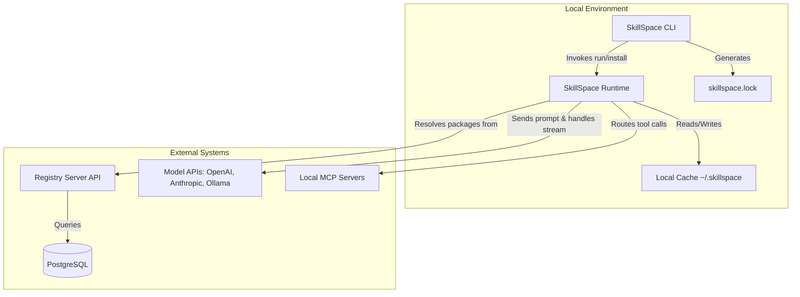

# Chapter 1: The Project — What It Is and Why It Exists

This chapter serves as the executive overview of the SkillSpace project. It outlines the core problems the software was built to address, the overarching solution it provides, and the fundamental technical decisions that shaped its architecture. By the end of this chapter, you will possess a complete mental model of what SkillSpace is, why it was built the way it was, and the vocabulary used throughout the codebase.

---

## 1. The Problem This Project Solves

The development of AI capabilities—such as specialized prompts, agent configurations, and workflow automation—suffers from severe fragmentation and lack of standard tooling. Specifically, engineering teams using AI encounter three compounding problems:

1.  **Prompt Drift:** Prompts are often stored informally in personal documents, shared via Slack, or hardcoded directly into application logic. Because there is no concept of a "lock file" or version control specific to these capabilities, teams suffer from inconsistent execution. A prompt that works today might break tomorrow when a different developer uses an outdated version of it.
2.  **Platform Lock-In:** An AI capability meticulously crafted for Anthropic's Claude (`claude-3-5-sonnet`) typically relies on Claude-specific syntax and XML tag structures. If a team wants to switch to OpenAI's `gpt-4o` or run a local model like `llama3.2` via Ollama, the entire capability must be manually rewritten to accommodate the new API format and message structure.
3.  **Discoverability:** New developers joining an organization have no standardized way to discover existing, approved AI capabilities. Unlike traditional software development, which relies on package managers like `npm` or `pip` to distribute and track dependencies, AI capabilities are usually recreated from scratch, leading to wasted effort and deviation from established best practices.

**What SkillSpace Does Not Solve:**
It is critical to note that SkillSpace is not designed to make models inherently faster, cheaper, or more accurate. It does not replace the Model Context Protocol (MCP); rather, it uses MCP as a primitive. SkillSpace is exclusively focused on the **distribution, versioning, and portability** of how AI capabilities are packaged and shared.

---

## 2. The Solution at a Glance

SkillSpace is the universal runtime and registry for AI capabilities. It allows developers to install, share, version, and execute AI skills, agents, and workflows using the exact same paradigms they use to manage traditional software packages. 

The system relies on a few core capabilities:

*   **Universal Packaging:** Capabilities are encapsulated into `.skillpkg` files containing a declarative manifest (`skill.yaml`), optional knowledge bases, evaluation tests, and model-specific adapters.
*   **Single-Command Installation:** Using the CLI, a developer can run `skillspace install security-review`. This fetches the package, installs it into a local registry cache (`~/.skillspace/registry/`), and automatically updates the `skillspace.lock` file ensuring deterministic reproducibility across teams.
*   **Cross-Model Execution:** The SkillSpace Runtime (SSR) dynamically transforms the universally defined prompts into the exact API payload required by the target model. Thus, a single command like `skillspace run security-review --model claude` or `skillspace run security-review --model openai` executes the same logic seamlessly against different endpoints.
*   **Strict Security & Sandboxing:** Capabilities must declare their permissions upfront in `skill.yaml` (e.g., `filesystem.read`, `network.fetch`). The execution engine enforces these requests strictly, throwing exceptions (`PermissionDeniedError`) if a skill overreaches.

---

## 3. Key Design Decisions

The architecture of SkillSpace is defined by a few opinionated, unyielding design decisions aimed at maximizing reliability, portability, and security:

1.  **Monorepo Architecture (Turborepo):** The entire system—including the CLI, the Runtime (SSR), the Next.js Registry, and shared schemas—is housed in a single monorepo. This was chosen to ensure that a change to the core `SkillSchema` instantly propagates type errors across the registry backend and the local CLI execution pipeline, preventing version skew and integration bugs.
2.  **Strict Runtime Validation (Zod):** Every interaction—whether it is parsing a downloaded `skill.yaml`, receiving a payload at the Registry API, or validating the JSON output returned by an LLM—is strictly parsed using `zod`. This guarantees that malformed configurations fail fast before they reach the execution layer.
3.  **The Model Adapter Layer (MAL):** Rather than forcing prompt engineers to write different versions of their prompts for every LLM, the system uses the MAL. Instructions are stored in a model-agnostic format, and the MAL acts as a translation layer at runtime. This isolates model API churn from the core logic.
4.  **Decoupled Registry and Runtime:** The SkillSpace Runtime (`packages/runtime`) has no hard dependency on the Next.js registry backend for execution. Once a package is downloaded and stored in the local cache (`~/.skillspace`), the runtime executes it completely offline (save for the actual API call to the LLM). This ensures extreme resilience; if the registry server goes down, local execution remains entirely unaffected.
5.  **PostgreSQL + Prisma:** For the Registry Server, a relational database was chosen over a document store to strictly enforce uniqueness constraints on packages (`name` + `scope`), manage complex relational data like Organization Memberships, and handle deterministic version resolution efficiently.

---

## 4. Technology Stack

SkillSpace leverages a modern, TypeScript-first ecosystem to ensure type safety from the database layer all the way to the CLI interface.

| Technology / Library | Role in the Project |
| :------------------- | :--------------------------------------------------------------------------------------------------------- |
| **Node.js / Bun** | The execution environment for the CLI. Bun provides ultra-fast binary bundling and execution speeds. |
| **TypeScript** | The primary language used across the entire repository, providing comprehensive type checking and autocompletion. |
| **Next.js (App Router)**| Powers both the Registry REST API and the Web Dashboard for package discovery and analytics. |
| **Prisma** | The Object-Relational Mapper (ORM) used by the Next.js backend to interface with the database safely. |
| **PostgreSQL** | The primary relational database used to store users, organizations, package metadata, and execution logs. |
| **Turborepo** | The build system used to orchestrate tasks across the monorepo, caching outputs to speed up CI/CD. |
| **Zod** | Used universally for schema declaration and runtime data validation. |
| **Commander.js** | The framework powering the interactive, strictly-typed Command Line Interface in `apps/cli`. |
| **Jest** | The testing framework utilized for both unit testing schemas/adapters and running End-to-End CLI workflows. |

---

## 5. High-Level System Diagram

The following diagram illustrates how the components of SkillSpace interact. Notice how the CLI acts as a thin wrapper over the SkillSpace Runtime (SSR), and how the Registry Server is completely isolated from the execution path once a skill is installed.



---

## 6. Repository Structure Explained

The repository is organized as a pnpm workspace using Turborepo. Understanding this structure is crucial for navigating the codebase.

```text
skillspace/
├── apps/
│   ├── cli/                    # The user-facing Command Line Interface. Contains all subcommands (init, run, install) in `src/commands/`.
│   ├── registry/               # The Next.js backend. Contains the Web UI, API routes (`app/api/`), and the Prisma schema (`prisma/schema.prisma`).
│   ├── vscode/                 # The future VS Code extension integrating the runtime directly into the IDE.
│   └── docs/                   # The documentation site content.
│
├── packages/
│   ├── runtime/                # The core engine (@skillspace/runtime). Handles skill resolution (`resolver.ts`), execution (`executor.ts`), and the Model Adapter Layer.
│   ├── schema/                 # Shared Zod validators (@skillspace/schema). Enforces data integrity across the CLI and Registry.
│   ├── sdk-ts/                 # The TypeScript SDK, enabling developers to embed SkillSpace capabilities into custom Node/Edge applications.
│   ├── sdk-python/             # The Python SDK equivalent.
│   └── lsp/                    # The Language Server Protocol implementation providing real-time validation and autocompletion for `skill.yaml` files.
│
├── e2e/                        # End-to-End integration tests that run the compiled CLI against mock registries and model APIs.
├── examples/                   # Example skill packages and workflows used for demonstration and testing.
├── UI_UX/                      # Design assets, mockups, and UI components for the web dashboard.
├── package.json                # The workspace root configuration, defining global devDependencies and scripts.
├── turbo.json                  # Turborepo task pipeline configuration (build, lint, test execution order).
└── pnpm-workspace.yaml         # Defines the monorepo package boundaries.
```

---

## 7. Glossary of Domain Terms

To work effectively within the SkillSpace codebase, you must understand its specific domain language.

*   **Capability:** A generic term for anything executable by the SkillSpace Runtime. This includes Skills, Agents, Workflows, and MCP configurations.
*   **Skill:** The fundamental unit of execution. A declarative, versioned package defining a system prompt, a user template, configuration boundaries, and specific output schemas.
*   **Skill Package (`.skillpkg`):** The compiled, tar-gzipped distribution format of a capability, containing the `skill.yaml`, optional adapters, testing data, and knowledge files.
*   **SkillSpace Runtime (SSR):** The core deterministic execution engine located in `packages/runtime`. It is entirely decoupled from the CLI and can be embedded via the SDK.
*   **Model Adapter Layer (MAL):** The subsystem within the SSR responsible for translating agnostic `skill.yaml` instructions into the bespoke JSON payloads required by specific model providers (e.g., Anthropic Messages API, OpenAI Chat Completions).
*   **Local Registry Cache:** The directory (`~/.skillspace/registry/`) where downloaded packages are stored, mapped by `name@version`, ensuring offline availability and high-speed execution.
*   **Permission Enforcer:** The security guardrail component that inspects a skill's declared permissions (e.g., `filesystem.write`) against the operations requested at runtime, throwing exceptions if boundaries are crossed.
*   **MCP (Model Context Protocol):** A standardized protocol for models to interact with local or remote tools. SkillSpace manages and routes these connections as a first-class citizen.
