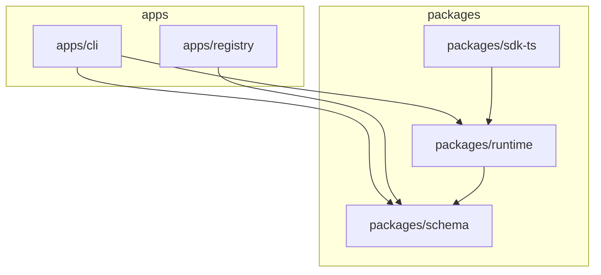

# Chapter 3: Architecture Deep Dive

This is the most critical chapter for understanding how SkillSpace operates under the hood. SkillSpace is not just a thin API wrapper; it is a full runtime environment encompassing a compiler-like resolver, an abstraction layer for LLMs, a strict permission sandbox, and a decentralized registry backend.

---

## 1. Architectural Style

SkillSpace is built using a **Ports and Adapters (Hexagonal)** architectural style for its execution engine, combined with a **Monolithic Client/Server** model for its registry. 

*   **Hexagonal Runtime:** The core business logic—executing an AI capability—lives entirely in `packages/runtime/src/executor.ts`. This core is completely decoupled from the transport mechanisms. The "Ports" are the generic structures defined in `@skillspace/schema`. The "Adapters" are the classes in `packages/runtime/src/adapters/` that translate generic intents into the specific HTTP payloads required by Anthropic, OpenAI, or Ollama. 
*   **State Isolation:** The CLI (`apps/cli`) contains zero business logic; it merely formats input, calls the `Executor`, and writes output.
*   **Decentralized Availability:** Because skills are cached locally into `~/.skillspace/registry/`, the system is resilient. If the remote Next.js Registry server goes down, local execution remains entirely unaffected.

---

## 2. The Dependency Graph

The project is structured such that dependency lines only point "inward" toward the core schemas.

**Key Takeaways:**
*   `packages/schema` is the absolute core. It has zero external dependencies inside the workspace. It enforces the "shape" of everything.
*   `apps/cli` depends on `packages/runtime`, acting purely as an I/O driver.
*   `packages/runtime` does *not* depend on the Next.js registry. The runtime executes local files. The CLI is responsible for fetching files from the registry and writing them to disk.

---

## 3. Request Lifecycle Walkthrough

To truly understand the architecture, let's trace the most complex flow in the system: **Running a skill that requires MCP tool calls.**

**The Command:** `skillspace run code-analyzer --input ./src --model claude-3-5-sonnet`

**Trace Path:**
1.  **Entry Point (`apps/cli/src/commands/run.ts`):** 
    *   Parses the arguments (`--input`, `--model`). 
    *   Instantiates the `Executor` from `@skillspace/runtime`.
2.  **Resolution (`packages/runtime/src/resolver.ts`):**
    *   The `SkillResolver` searches `~/.skillspace/registry/code-analyzer@latest/skill.yaml`.
    *   It parses the YAML and immediately validates it against `SkillSchema` using `zod`.
3.  **Permission Enforcement (`packages/runtime/src/permissions.ts`):**
    *   The user passed `./src` as input. The `Executor` detects a directory and reads its contents (`fs.readdirSync`).
    *   The `PermissionEnforcer` asserts that `filesystem.read` is declared in `skill.yaml`. If not, a `PermissionDeniedError` is thrown immediately.
4.  **Firewall Screening (`packages/runtime/src/firewall/LocalModelScreener.ts`):**
    *   If `FIREWALL_ENABLED=true`, the input contents (`./src`) are sent to a local, fast LLM (e.g., `ollama/llama3`) to check for prompt injections. 
    *   If safe, execution proceeds.
5.  **Adapter Selection (`packages/runtime/src/adapters/registry.ts`):**
    *   The `AdapterRegistry` matches `claude-3-5-sonnet` to the `ClaudeAdapter`.
6.  **MCP Server Hydration (`packages/runtime/src/mcp/McpRegistry.ts`):**
    *   The executor inspects `skill.mcpServers`. If it finds local servers (e.g., `github`, `filesystem`), it initiates `stdio` or `http` connections to them and retrieves their tool schemas (`listTools`).
7.  **The LLM Loop (`packages/runtime/src/executor.ts`):**
    *   **Iteration 1:** The `ClaudeAdapter` constructs a payload with the `system` prompt, the expanded `./src` input, and the available MCP tools. It makes the HTTP request to Anthropic.
    *   Anthropic responds with a `tool_call` request (e.g., `mcp_github_search_code`).
    *   The executor traps this response, extracts the arguments, verifies the server's permissions, and routes the call via `McpRegistry` to the local GitHub MCP server.
    *   The local MCP server replies with the search results.
    *   **Iteration 2:** The `ClaudeAdapter` constructs a new payload, appending the `tool_result`. Anthropic responds with the final textual analysis.
8.  **Output Parsing & Validation:**
    *   If the skill specifies `output_format: json`, the raw text is parsed and validated against the `output_schema`.
    *   The result is printed to `stdout` by the CLI.
9.  **Telemetry (`packages/runtime/src/telemetry.ts`):**
    *   The execution time, model used, and success/failure status are logged asynchronously.
10. **Cleanup:**
    *   The `McpRegistry` cleanly shuts down `stdio` processes to prevent memory leaks.

---

## 4. Module Breakdown

### `@skillspace/schema` (packages/schema)
*   **Purpose:** The single source of truth for structural definitions.
*   **Public Interface:** `SkillSchema`, `AgentSchema`, `validateSkill()`, `validateAgent()`.
*   **Key Design:** Strict Zod schemas. If a field isn't declared in the schema, it gets stripped out. This ensures backward and forward compatibility.

### `@skillspace/runtime` (packages/runtime)
*   **Purpose:** Execution, caching, and adapter logic.
*   **Internal Structure:**
    *   `executor.ts`: The main loop (described above).
    *   `adapters/`: Contains `base.ts` (Interface) and concrete implementations (`openai.ts`, `claude.ts`).
    *   `cache.ts`: Manages `~/.skillspace/registry/`, enforcing deterministic `sha256` checksum matching.
    *   `mcp/`: Contains `McpRegistry.ts` which handles the complex IPC communication required for MCP.

### `apps/registry`
*   **Purpose:** The central repository for discovering and distributing packages.
*   **Internal Structure:** 
    *   `app/api/`: REST endpoints.
    *   `prisma/schema.prisma`: The database schema mapping Users, Organizations, and PackageVersions.
*   **Key Design:** Built for extreme read-heavy traffic. It serves `.skillpkg` files using pre-signed URLs from an object store (S3/R2) to offload bandwidth from the Node.js process.

---

## 5. Cross-Cutting Concerns

*   **Error Handling:** Errors are strictly typed. The `ExecutionError` class includes a `retryable` boolean. If an adapter receives an HTTP 429 (Rate Limit) or 503 (Service Unavailable), the executor automatically implements exponential backoff. Errors like `PermissionDeniedError` are immediately fatal.
*   **Configuration:** Loaded via `packages/runtime/src/config.ts` from `~/.skillspace/config.yaml`. It manages model API keys locally. It is completely isolated from the Registry's database.
*   **Authentication:** The CLI stores a JWT in `~/.skillspace/credentials`. The Registry validates this JWT for publishing packages (`POST /api/packages`). Executing a skill requires no authentication with the registry.
*   **State Management:** The Runtime is **100% stateless** between executions. There is no conversation history stored by default unless a skill explicitly implements memory through a filesystem mechanism.

---

## 6. The Twelve Factors Audit

SkillSpace is designed for high reliability and scale.

*   ✅ **I. Codebase:** One codebase (monorepo), multiple deploys.
*   ✅ **II. Dependencies:** Explicitly declared via `package.json` and strict `pnpm-lock.yaml`.
*   ✅ **III. Config:** Environment variables and local YAML used for strict environment isolation.
*   ✅ **IV. Backing services:** Database and S3 treated as attached resources in the Registry.
*   ✅ **V. Build, release, run:** Handled strictly by Turborepo and the CLI publish mechanisms.
*   ✅ **VI. Processes:** The Runtime executes as a stateless process.
*   ✅ **VII. Port binding:** The Registry exports HTTP seamlessly on port 3000.
*   ✅ **VIII. Concurrency:** Handled natively by Node.js async I/O.
*   ✅ **IX. Disposability:** The runtime can be killed instantly. MCP servers are aggressively disconnected in `finally` blocks.
*   ✅ **X. Dev/prod parity:** Local execution is 100% identical to how the SDK embeds the runtime in production.
*   ✅ **XI. Logs:** Telemetry and debug logging emitted as event streams.
*   ✅ **XII. Admin processes:** Database migrations (`npx prisma migrate`) are separated from the application lifecycle.
