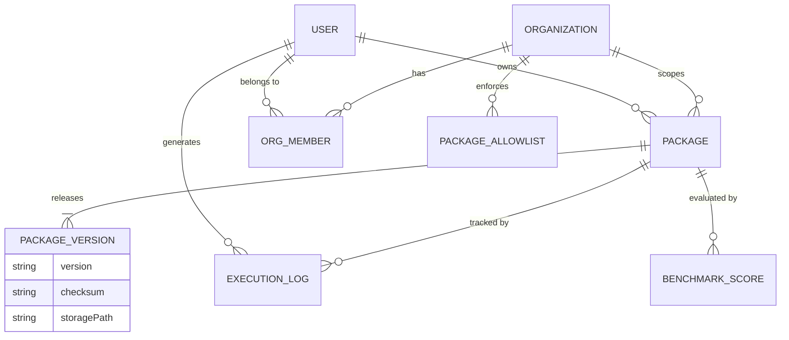

# Chapter 4: The Data Model

This chapter extensively maps the core data models of SkillSpace. The system enforces strict typing at two separate layers: the **Runtime Layer** (governed by Zod schemas and executed locally) and the **Registry Layer** (governed by Prisma and executed in PostgreSQL). 

---

## 1. Data Model Overview

SkillSpace is stateless at runtime but requires strict schema enforcement for packaging and distribution. The two environments look like this:

*   **Local Execution (Runtime):** The source of truth is the `.skillpkg` file, specifically the `skill.yaml` (or `agent.yaml`) contained inside. This is validated via `@skillspace/schema`.
*   **Remote Distribution (Registry):** The source of truth is the PostgreSQL database, managed via Prisma, which tracks users, organizations, package metadata, versions, and execution analytics.

---

## 2. Runtime Schema: The `skill.yaml`

The fundamental unit of execution is a Skill. The shape is strictly defined in `packages/schema/src/skill.schema.ts`. If a published `skill.yaml` fails to match this schema, the registry rejects the upload. If a cached `skill.yaml` fails this schema, the `SkillResolver` throws an error.

### Core Properties

| Field | Type | Required | Description |
| :--- | :--- | :--- | :--- |
| `name` | string | Yes | Kebab-case identifier (max 214 chars). Must be globally unique within the registry namespace. |
| `version` | string | Yes | Strictly enforced Semantic Versioning (`MAJOR.MINOR.PATCH`). |
| `description` | string | Yes | Human-readable summary (max 200 chars). |
| `author` | string | Yes | The creator or publisher of the skill. |
| `license` | string | Yes | e.g., "MIT" or "Proprietary". |

### Instructions & Capability Definition

This dictates exactly how the LLM receives the prompt.

| Field | Type | Default | Description |
| :--- | :--- | :--- | :--- |
| `system` | string | *N/A* | The core system prompt. Dictates the persona and rules. |
| `user_template` | string | *N/A* | The formatting string. **Must contain the literal `{{input}}`** for the runtime to inject arguments. |
| `output_format` | enum | `text` | One of `json`, `text`, `markdown`. If `json`, the runtime attempts `JSON.parse()` on the output. |
| `output_schema` | object | `{}` | A JSON Schema defining the expected shape of the JSON output. |

### Security & Integrations

| Field | Type | Default | Description |
| :--- | :--- | :--- | :--- |
| `permissions` | array | `[]` | Crucial security layer. Valid values: `filesystem.read`, `filesystem.write`, `network.fetch`, `tools.browser`, `tools.terminal`. |
| `mcpServers` | array | `[]` | Local or remote MCP servers required. The executor will automatically hydrate these tools and pass them to the LLM. |

---

## 3. Registry Schema: PostgreSQL Entity Reference

The Next.js backend leverages Prisma to manage the relational data. Below is the exhaustive entity reference found in `apps/registry/prisma/schema.prisma`.

### User & Organization Entities

**`User`**
Represents a developer authenticated with the Registry.
*   **Core Fields:** `id` (UUID), `username`, `email`, `passwordHash`, `plan`, `verified`.
*   **Relationships:** Has many `Package`, `OrgMember`, `ExecutionLog`, `PlaygroundSession`.

**`Organization`**
Represents a team or enterprise namespace. Packages can be scoped to an organization (e.g., `@acme/security-review`).
*   **Core Fields:** `id` (UUID), `slug` (Unique), `name`, `plan`.
*   **Relationships:** Has many `OrgMember`, `Package`, `PackageAllowlist`, `AccessPolicy`.

**`OrgMember`**
The join table handling RBAC for organizations.
*   **Core Fields:** `role` (Admin vs. Member).
*   **Relationships:** Connects `User` and `Organization`.

### Package Distribution Entities

**`Package`**
The logical grouping of a capability across all its versions.
*   **Core Fields:** 
    *   `id` (UUID)
    *   `type`: Distinguishes between `skill`, `agent`, `workflow`, `mcp`, or `knowledge`.
    *   `name`: The global or scoped name (Unique).
    *   `scope`: Optional org slug.
    *   `downloads`: Analytics counter.
    *   `verified`: Boolean for trusted publishers.
*   **Relationships:** Belongs to `User` (Owner) and optionally `Organization`. Has many `PackageVersion`.

**`PackageVersion`**
A specific, immutable release of a package.
*   **Core Fields:** 
    *   `version`: The semver string.
    *   `manifest`: The fully parsed `skill.yaml` stored as a JSON string for fast querying.
    *   `storagePath`: The S3 or Cloudflare R2 bucket path to the actual `.skillpkg` tarball.
    *   `checksum`: The `sha256` hash used by the CLI to verify package integrity.
    *   `deprecated`: Soft deprecation flag.

### Analytics & Guardrails

**`ExecutionLog`**
Stores telemetry for analytics and enterprise auditing.
*   **Core Fields:** `packageId`, `version`, `modelId`, `durationMs`, `tokensUsed`, `status` (success/error).

**`BenchmarkScore`**
Used to display quality metrics in the marketplace.
*   **Core Fields:** `suiteName`, `score`, `passedCount`, `totalCount`.

**`PackageAllowlist`**
For enterprise plans: forces the CLI/Registry to only permit downloading of explicitly approved capabilities.
*   **Core Fields:** `orgId`, `package` (string name).

---

## 4. Entity Relationship Diagram (Registry)

---

## 5. Migration Strategy

SkillSpace uses Prisma for schema management. 

1.  **Development Workflow:** Developers use `npx prisma db push` to synchronize their local database without generating permanent migration files.
2.  **Production Workflow:** Before merging a schema change to `main`, a developer must run `npx prisma migrate dev --name <description>`. This generates a deterministic `.sql` file in `prisma/migrations/`.
3.  **Deployment:** During CI/CD, the pipeline runs `npx prisma migrate deploy` against the production database. This applies pending migrations sequentially and ensures zero-downtime structural updates.

---

## 6. Local Data Cache

While the PostgreSQL database handles the remote logic, the local execution environment maintains a cache in `~/.skillspace/`.

1.  `~/.skillspace/config.yaml`: Stores `default_model` and API tokens.
2.  `~/.skillspace/credentials`: Stores the JWT for CLI publishing.
3.  `~/.skillspace/registry/<name>@<version>/`: The extracted `.skillpkg` files containing the runtime `skill.yaml`.
4.  `./skillspace.lock`: Placed in the *current working directory* of a project. It locks dependencies to specific versions and checksums to ensure identical behavior across a team.
